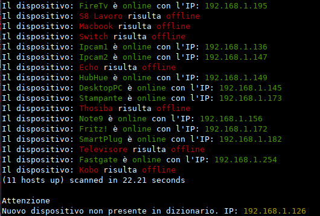

# Netwok_intruder_watcher
> Monitorare i dispositivi connessi alla propria rete locale

Un semplice script in Python che permette di monitorare con facilità i dispositivi connessi alla propria rete locale, comparando gli indirizzi ip ad un dizionario personale.

## Librerie utilizzate

Di seguito le librerie utilizzate:

```python
import os
import re
from termcolor import colored
```

## Features

Una volta lanciato il programma, verra eseguita una scansione della rete utilizzando: 

```bash
nmap
```

Pre installare nmap digitare il seguente comando nel terminale:

```bash
sudo apt-get install nmap
```

Il comando che verrà eseguito dallo script è il seguente:

```bash
nmap -sP 192.168.1.0/24
```
Verrà quindi eseguiti una scansione rapida di tutti i dispositivi connessi alla rete e online.

## Costruzione dizionario

Per poter effetuare una comparazione sarà necessiaro modificare il dizionario ip:

```python
ipdict = {
    "Dispositivo": "Indirizzo ip"
}
```
Inserendo i dati corretti di tutti i dipsositivi conoscuti connessi alla rete.

Una volta creato il dizionario, sarà possibile effetuare una comparazione tra i dispositivi online rilevati da nmap e quelli presenti nel dizionario. 
Nel caso venisse rilevata una discrepanza, verrà segnalato che è presente un dispositivo non conetenuto nel dizionario:

```
Nuovo dispositivo non presente in dizionario. IP: 192.168.1.*
```

L'output finale somiglia al seguente, a seconda dei propri dispositivi connessi e al nome assegnato. I dispositivi e gli ip sono puramente illustrativi, per avere lo stesso risultato bisogna costruire il prorpio dizionario personale come illustrato precedentemente. 




## Contribuire

Qualsiasi contributo è più che buon accetto. Ho cercato di commentare il più possibile
il codice per renderlo il più chiaro possibile, ma in alcuni punti le soluzioni che ho
adoperato sono decisamente poco eleganti oltre che non ottimali.
Per questo invito tutti a dare il loro contributo.

## To do

Implementare la funzione di aggiunta dei nuovi IP esternalizzando il dizionario su un file esterno. 

## Licensing

"The code in this project is licensed under MIT license."

## Read_Me

Per realizzare questo ReadMe ho utilizzato la seguente [Repository](https://github.com/jehna/readme-best-practices.git)

This ReadMe was writtin using this [Repository](https://github.com/jehna/readme-best-practices.git)